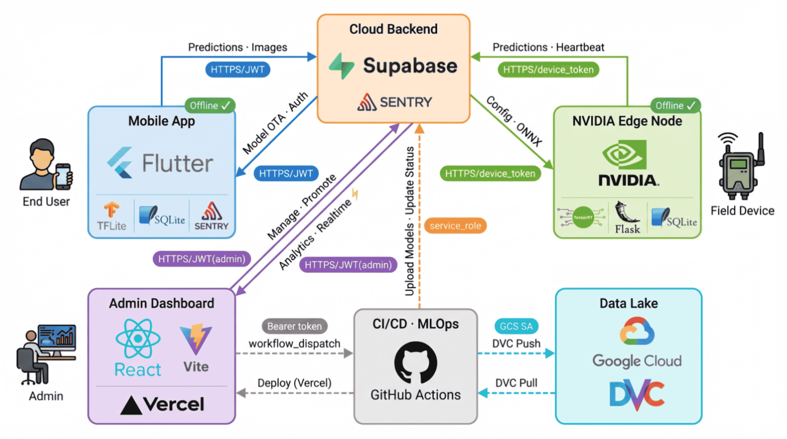

# AgriKD — Plant Leaf Disease Recognition via Knowledge Distillation

AgriKD is a capstone research system for real-time plant leaf disease detection using Knowledge
Distillation: a ViT-Base teacher model distills into a Truncated MobileNetV2 student optimized for
on-device inference on mobile and edge hardware. The repository provides an end-to-end pipeline —
from model training and 4-format conversion to a Flutter mobile app, a React admin dashboard, and a
Jetson edge inference station — enabling researchers and practitioners to reproduce results on Tomato
and Burmese Grape Leaf datasets or extend the system to new leaf types with minimal configuration.

## System Architecture



## Datasets

| Dataset            | Classes | Status |
| ------------------ | ------- | ------ |
| Tomato             | 10      | Active |
| Burmese Grape Leaf | 5       | Active |
| Potato             | 7       | Active |

Adding a new leaf type requires only a labeled dataset folder and a config JSON in
`mlops_pipeline/configs/` — no code changes needed.

## Components

| Component       | Technology                         | Description                                |
| --------------- | ---------------------------------- | ------------------------------------------ |
| Mobile App      | Flutter 3.x + Riverpod + TFLite    | Offline-first diagnosis, cloud sync        |
| Admin Dashboard | React 18 + Vite 6 + Supabase       | Model, user, and data management (Vercel)  |
| MLOps Pipeline  | Python 3.10 + DVC + GitHub Actions | 4-format conversion & evaluation           |
| Jetson Edge     | TensorRT FP16 + PyQt5 + Flask      | Real-time edge inference + Active Learning |
| Database (IaC)  | Supabase PostgreSQL + RLS          | 28 SQL migrations, 13 tables               |

## Model Pipeline

```
.pth (checkpoint)
  |
  +--> .onnx (intermediate)
         |
         +--> .tflite float32  (mobile)
         +--> .tflite float16  (mobile, smaller)
         +--> .engine FP16     (Jetson TensorRT)
```

All formats are uploaded to Supabase Storage. Jetson devices auto-detect their SM architecture and
share pre-built engines when available.

## Installation

### Python Pipeline

```bash
python -m venv venv_mlops
source venv_mlops/bin/activate        # Windows: venv_mlops\Scripts\activate

# Install PyTorch separately (choose CPU or CUDA build):
pip install torch torchvision --index-url https://download.pytorch.org/whl/cpu
# For CUDA: --index-url https://download.pytorch.org/whl/cu121

pip install -r mlops_pipeline/requirements.txt
```

> **Note:** `convert_pth_to_tflite.py` (ai-edge-torch path) requires Linux. On Windows/macOS,
> use the ONNX → TFLite path via `convert_onnx_to_tflite.py` instead.

### Flutter App

```bash
cd mobile_app
flutter pub get
python ../sync_env.py          # distributes .env to all sub-projects
flutter run
```

TFLite models are bundled in `assets/models/` — no separate download required.

### Admin Dashboard

```bash
cd admin-dashboard
npm install
npm run dev
```

## How to Run

### Model Pipeline

The pipeline is config-driven. Pass a config JSON to the orchestrator:

```bash
# Tomato
python mlops_pipeline/scripts/run_pipeline.py \
  --config mlops_pipeline/configs/tomato.json

# Burmese Grape Leaf
python mlops_pipeline/scripts/run_pipeline.py \
  --config mlops_pipeline/configs/burmese_grape_leaf.json
```

Outputs (ONNX, TFLite, engine) are written to `models/<leaf_type>/` and uploaded to Supabase
Storage if credentials are configured.

### Evaluation Only

```bash
python mlops_pipeline/scripts/evaluate_models.py \
  --config mlops_pipeline/configs/tomato.json
```

Produces Top-1 accuracy, inference latency, and KL Divergence across all converted formats.

### Jetson Edge Inference

```bash
# Headless (Flask REST API + SyncEngine)
python jetson/app/main.py

# With PyQt5 GUI
python jetson/app/gui_app.py
```

First run auto-builds the TensorRT FP16 engine from ONNX (approximately 5 minutes). Subsequent runs
load the cached engine directly. Zero-Touch Provisioning for new devices:

```bash
python jetson/scripts/provision.py
```

## Evaluation Results

| Dataset            | Classes | Accuracy | TFLite Size |
| ------------------ | ------- | -------- | ----------- |
| Tomato             | 10      | 87.2%    | ~0.96 MB    |
| Burmese Grape Leaf | 5       | 87.3%    | ~0.96 MB    |

## Real-world Deployment

The Jetson edge station runs TensorRT FP16 inference with a PyQt5 GUI, a rate-limited Flask REST API
(30 req/min, 10 MB upload limit), and an Active Learning module that flags low-confidence samples
for retraining. The Flutter app targets Android with offline-first TFLite inference — the release
APK is 84.2 MB (fat) / 31.3 MB (arm64-v8a) — and syncs diagnosis records to Supabase when online.

## Documentation

All guides are in [`docs/`](docs/README.md):

| Guide                      | Path                                                                          |
| -------------------------- | ----------------------------------------------------------------------------- |
| System Technical Reference | [docs/technical/system_reference.md](docs/technical/system_reference.md)         |
| MLOps Pipeline Setup       | [docs/guides/mlops_pipeline_setup.md](docs/guides/mlops_pipeline_setup.md)       |
| Jetson Deployment & GUI    | [docs/guides/jetson_deployment_guide.md](docs/guides/jetson_deployment_guide.md) |
| Flutter App Build          | [docs/guides/flutter_app_build.md](docs/guides/flutter_app_build.md)             |
| Admin Dashboard Manual     | [docs/guides/admin_dashboard_manual.md](docs/guides/admin_dashboard_manual.md)   |
| Supabase Setup             | [docs/guides/supabase_setup.md](docs/guides/supabase_setup.md)                   |
| CI/CD Setup                | [docs/guides/cicd_setup.md](docs/guides/cicd_setup.md)                           |
| Product Release Guide      | [docs/guides/product_release.md](docs/guides/product_release.md)                 |

## Acknowledgements

**[timm](https://github.com/huggingface/pytorch-image-models)** provides the ViT-Base teacher model
used for Knowledge Distillation pre-training. **[onnx2tf](https://github.com/PINTO0309/onnx2tf)**
handles ONNX → TFLite conversion. **[tflite_flutter](https://pub.dev/packages/tflite_flutter)**
enables on-device inference in the Flutter app. **[Supabase](https://supabase.com)** provides the
managed PostgreSQL backend, authentication, and model storage. **[DVC](https://dvc.org)** versions
training datasets on Google Cloud Storage. **[Sentry](https://sentry.io)** provides error tracking
across the mobile app and admin dashboard.
