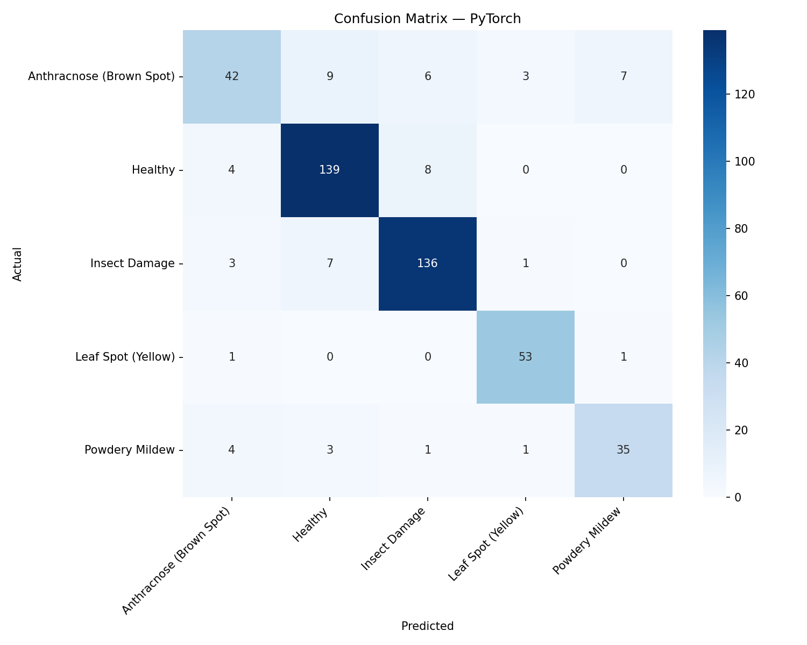

## AgriKD Model Benchmark Report

**Date:** 2026-03-21 12:53
**Test Samples:** 464
**Dataset:** 5 classes

### Benchmark Summary

| Format   |   Size (MB) |   Params (M) |   FLOPs (M) |   ms/img |     FPS |   Top-1 % |
|----------|-------------|--------------|-------------|----------|---------|-----------|
| PyTorch  |       1.981 |         0.49 |       374.7 |   30.333 |  32.967 |    87.284 |
| ONNX     |       1.869 |         0.49 |       374.7 |    3.694 | 270.698 |    87.284 |
| TFLite   |       0.955 |         0.49 |       374.7 |    7.525 | 132.893 |    87.069 |

### Latency Details

| Format   |   Lat Mean (ms) |   Lat Min (ms) |   Lat Max (ms) |   Lat P99 (ms) |     FPS |
|----------|-----------------|----------------|----------------|----------------|---------|
| PyTorch  |          30.333 |         17.124 |        113.727 |         61.973 |  32.967 |
| ONNX     |           3.694 |          1.965 |          9.782 |          7.983 | 270.698 |
| TFLite   |           7.525 |          5.631 |         17.539 |         14.375 | 132.893 |

### Classification Metrics (Real Test Data)

### PyTorch — Per-Class Metrics

| Class                    |   Precision |   Recall |   F1-Score |   Support |
|--------------------------|-------------|----------|------------|-----------|
| Anthracnose (Brown Spot) |      0.7778 |   0.6269 |     0.6942 |        67 |
| Healthy                  |      0.8797 |   0.9205 |     0.8997 |       151 |
| Insect Damage            |      0.9007 |   0.9252 |     0.9128 |       147 |
| Leaf Spot (Yellow)       |      0.9138 |   0.9636 |     0.9381 |        55 |
| Powdery Mildew           |      0.814  |   0.7955 |     0.8046 |        44 |
| Macro Avg                |      0.8572 |   0.8463 |     0.8499 |       464 |
| Weighted Avg             |      0.8694 |   0.8728 |     0.8697 |       464 |

### ONNX — Per-Class Metrics

| Class                    |   Precision |   Recall |   F1-Score |   Support |
|--------------------------|-------------|----------|------------|-----------|
| Anthracnose (Brown Spot) |      0.7778 |   0.6269 |     0.6942 |        67 |
| Healthy                  |      0.8797 |   0.9205 |     0.8997 |       151 |
| Insect Damage            |      0.9007 |   0.9252 |     0.9128 |       147 |
| Leaf Spot (Yellow)       |      0.9138 |   0.9636 |     0.9381 |        55 |
| Powdery Mildew           |      0.814  |   0.7955 |     0.8046 |        44 |
| Macro Avg                |      0.8572 |   0.8463 |     0.8499 |       464 |
| Weighted Avg             |      0.8694 |   0.8728 |     0.8697 |       464 |

### TFLite — Per-Class Metrics

| Class                    |   Precision |   Recall |   F1-Score |   Support |
|--------------------------|-------------|----------|------------|-----------|
| Anthracnose (Brown Spot) |      0.7636 |   0.6269 |     0.6885 |        67 |
| Healthy                  |      0.8797 |   0.9205 |     0.8997 |       151 |
| Insect Damage            |      0.9    |   0.9184 |     0.9091 |       147 |
| Leaf Spot (Yellow)       |      0.9138 |   0.9636 |     0.9381 |        55 |
| Powdery Mildew           |      0.814  |   0.7955 |     0.8046 |        44 |
| Macro Avg                |      0.8542 |   0.845  |     0.848  |       464 |
| Weighted Avg             |      0.8672 |   0.8707 |     0.8677 |       464 |

### Notes
- **Params/FLOPs** are identical across formats (same model architecture, same weights).
- **File size** differs due to serialization: TFLite uses FlatBuffer (most compact), ONNX uses Protobuf, PyTorch includes optimizer state.
- **Latency** measured on PC CPU. On mobile, TFLite + GPU Delegate or NNAPI can significantly outperform CPU-only inference.

### Sweet Spot Conclusion
- **Jetson Deployment:** `ONNX`/`TensorRT` — highest throughput for GPU-equipped edges.
- **Mobile App:** `TFLite` — smallest footprint, supports GPU Delegate & NNAPI for hardware acceleration on mobile.
