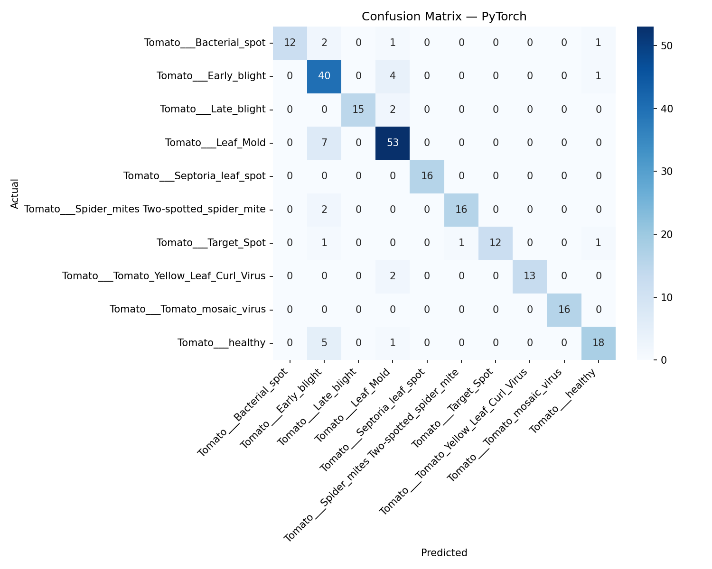
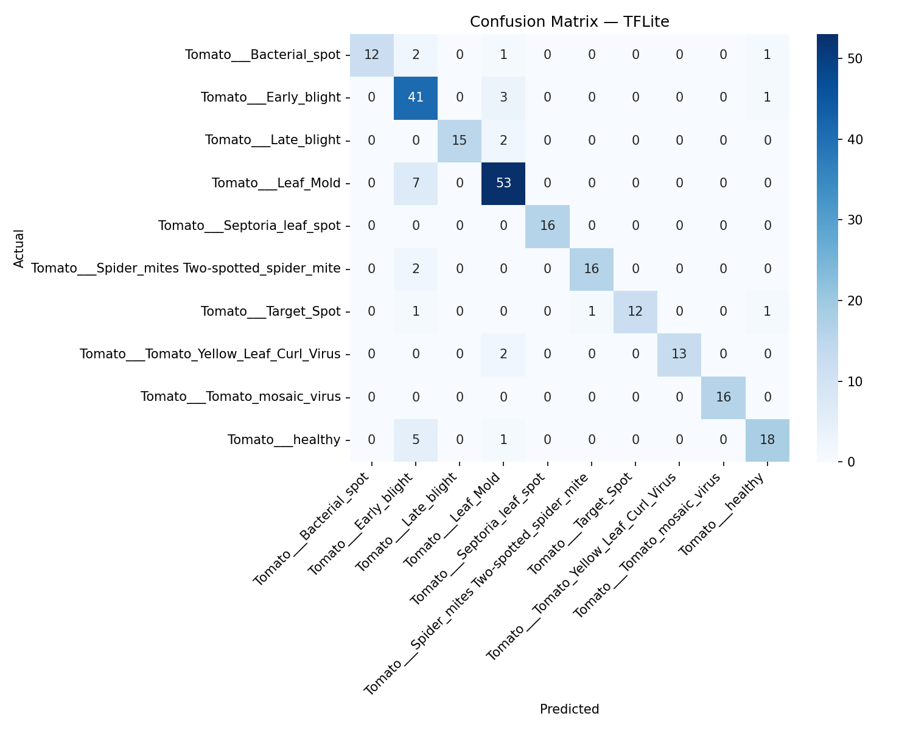

## AgriKD Model Benchmark Report

**Date:** 2026-03-21 12:52
**Test Samples:** 242
**Dataset:** 10 classes

### Benchmark Summary

| Format   |   Size (MB) |   Params (M) |   FLOPs (M) |   ms/img |     FPS |   Top-1 % |
|----------|-------------|--------------|-------------|----------|---------|-----------|
| PyTorch  |       1.986 |         0.49 |       374.7 |   34.351 |  29.111 |    87.190 |
| ONNX     |       1.874 |         0.49 |       374.7 |    5.123 | 195.204 |    87.190 |
| TFLite   |       0.957 |         0.49 |       374.7 |   11.253 |  88.863 |    87.603 |

### Latency Details

| Format   |   Lat Mean (ms) |   Lat Min (ms) |   Lat Max (ms) |   Lat P99 (ms) |     FPS |
|----------|-----------------|----------------|----------------|----------------|---------|
| PyTorch  |          34.351 |         20.540 |        229.288 |         78.451 |  29.111 |
| ONNX     |           5.123 |          2.166 |         15.277 |         11.547 | 195.204 |
| TFLite   |          11.253 |          5.563 |         26.333 |         22.358 |  88.863 |

### Classification Metrics (Real Test Data)

### PyTorch — Per-Class Metrics

| Class                                         |   Precision |   Recall |   F1-Score |   Support |
|-----------------------------------------------|-------------|----------|------------|-----------|
| Tomato___Bacterial_spot                       |      1      |   0.75   |     0.8571 |        16 |
| Tomato___Early_blight                         |      0.7018 |   0.8889 |     0.7843 |        45 |
| Tomato___Late_blight                          |      1      |   0.8824 |     0.9375 |        17 |
| Tomato___Leaf_Mold                            |      0.8413 |   0.8833 |     0.8618 |        60 |
| Tomato___Septoria_leaf_spot                   |      1      |   1      |     1      |        16 |
| Tomato___Spider_mites Two-spotted_spider_mite |      0.9412 |   0.8889 |     0.9143 |        18 |
| Tomato___Target_Spot                          |      1      |   0.8    |     0.8889 |        15 |
| Tomato___Tomato_Yellow_Leaf_Curl_Virus        |      1      |   0.8667 |     0.9286 |        15 |
| Tomato___Tomato_mosaic_virus                  |      1      |   1      |     1      |        16 |
| Tomato___healthy                              |      0.8571 |   0.75   |     0.8    |        24 |
| Macro Avg                                     |      0.9341 |   0.871  |     0.8972 |       242 |
| Weighted Avg                                  |      0.8866 |   0.8719 |     0.8743 |       242 |

### ONNX — Per-Class Metrics

| Class                                         |   Precision |   Recall |   F1-Score |   Support |
|-----------------------------------------------|-------------|----------|------------|-----------|
| Tomato___Bacterial_spot                       |      1      |   0.75   |     0.8571 |        16 |
| Tomato___Early_blight                         |      0.7018 |   0.8889 |     0.7843 |        45 |
| Tomato___Late_blight                          |      1      |   0.8824 |     0.9375 |        17 |
| Tomato___Leaf_Mold                            |      0.8413 |   0.8833 |     0.8618 |        60 |
| Tomato___Septoria_leaf_spot                   |      1      |   1      |     1      |        16 |
| Tomato___Spider_mites Two-spotted_spider_mite |      0.9412 |   0.8889 |     0.9143 |        18 |
| Tomato___Target_Spot                          |      1      |   0.8    |     0.8889 |        15 |
| Tomato___Tomato_Yellow_Leaf_Curl_Virus        |      1      |   0.8667 |     0.9286 |        15 |
| Tomato___Tomato_mosaic_virus                  |      1      |   1      |     1      |        16 |
| Tomato___healthy                              |      0.8571 |   0.75   |     0.8    |        24 |
| Macro Avg                                     |      0.9341 |   0.871  |     0.8972 |       242 |
| Weighted Avg                                  |      0.8866 |   0.8719 |     0.8743 |       242 |

### TFLite — Per-Class Metrics

| Class                                         |   Precision |   Recall |   F1-Score |   Support |
|-----------------------------------------------|-------------|----------|------------|-----------|
| Tomato___Bacterial_spot                       |      1      |   0.75   |     0.8571 |        16 |
| Tomato___Early_blight                         |      0.7069 |   0.9111 |     0.7961 |        45 |
| Tomato___Late_blight                          |      1      |   0.8824 |     0.9375 |        17 |
| Tomato___Leaf_Mold                            |      0.8548 |   0.8833 |     0.8689 |        60 |
| Tomato___Septoria_leaf_spot                   |      1      |   1      |     1      |        16 |
| Tomato___Spider_mites Two-spotted_spider_mite |      0.9412 |   0.8889 |     0.9143 |        18 |
| Tomato___Target_Spot                          |      1      |   0.8    |     0.8889 |        15 |
| Tomato___Tomato_Yellow_Leaf_Curl_Virus        |      1      |   0.8667 |     0.9286 |        15 |
| Tomato___Tomato_mosaic_virus                  |      1      |   1      |     1      |        16 |
| Tomato___healthy                              |      0.8571 |   0.75   |     0.8    |        24 |
| Macro Avg                                     |      0.936  |   0.8732 |     0.8991 |       242 |
| Weighted Avg                                  |      0.891  |   0.876  |     0.8782 |       242 |

### Notes
- **Params/FLOPs** are identical across formats (same model architecture, same weights).
- **File size** differs due to serialization: TFLite uses FlatBuffer (most compact), ONNX uses Protobuf, PyTorch includes optimizer state.
- **Latency** measured on PC CPU. On mobile, TFLite + GPU Delegate or NNAPI can significantly outperform CPU-only inference.

### Sweet Spot Conclusion
- **Jetson Deployment:** `ONNX`/`TensorRT` — highest throughput for GPU-equipped edges.
- **Mobile App:** `TFLite` — smallest footprint, supports GPU Delegate & NNAPI for hardware acceleration on mobile.
